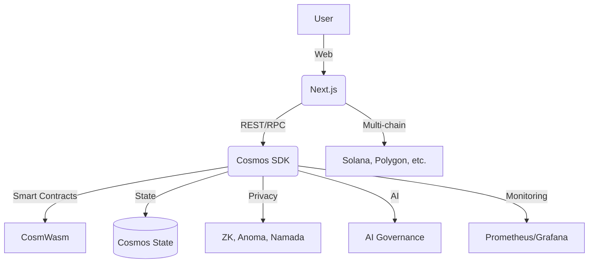

# LibraDemosChain – Architecture Technique

## Stack complète
- **Blockchain** : Cosmos SDK (Go), Tendermint BFT
- **Smart contracts** : CosmWasm (Rust)
- **Privacy** : ZK-SNARKs, Circom, Anoma, Namada, Ring Signatures
- **Interopérabilité** : IBC+, bridges, relayers
- **IA** : NEOMA (anti-désinformation, analyse, modération)
- **Frontend** : Next.js, CosmJS, interface multilingue
- **Monitoring** : Prometheus, Grafana, logs, APIs REST/gRPC

## Schéma d’architecture

## Modules clés
- privacy, ZK-KYC, DAO/gouvernance, multichain/IBC, IA NEOMA, monitoring

## Sécurité
- Audit CertiK, Quantstamp, tests de pénétration, vérification formelle ZK
- Gestion des clés, HSM, keyring-backend

## Documentation
- Voir [README.md](../README.md), [SECURITY.md](SECURITY.md), [STRUCTURE_IDEALE.md](STRUCTURE_IDEALE.md)