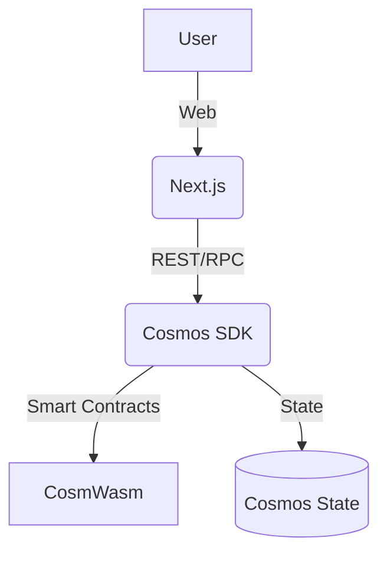

# LibraDemosChain Whitepaper

## Abstract
Brief summary of the project, its vision, and goals.

## Problem Statement
Describe the problem in current governance/crypto systems.

## Solution Overview
How LibraDemosChain addresses these problems.

## Architecture
- Cosmos SDK (Go) backend
- Next.js frontend
- CosmWasm smart contracts
- [Mermaid diagram](#architecture-diagram)

## Tokenomics
Describe the token model, distribution, incentives.

## Roadmap
- Q3 2025: MVP
- Q4 2025: Testnet
- Q1 2026: Mainnet
- ...

## FAQ
- **What is LibraDemosChain?**
- **How to participate?**
- ...

## Architecture Diagram

